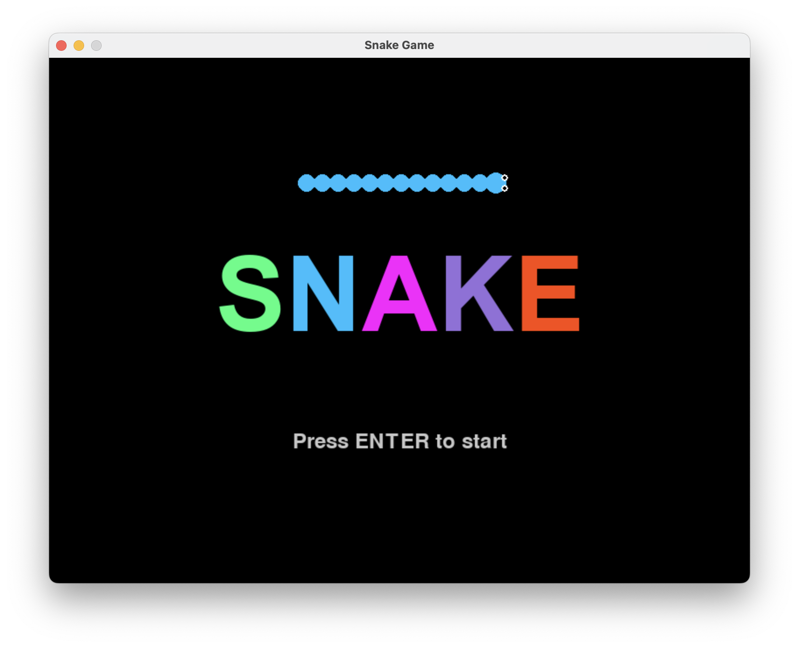
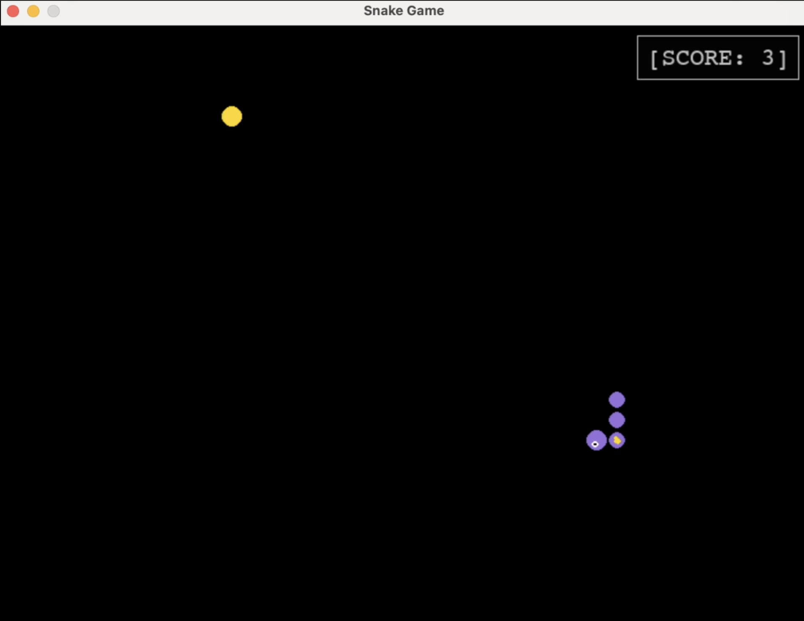
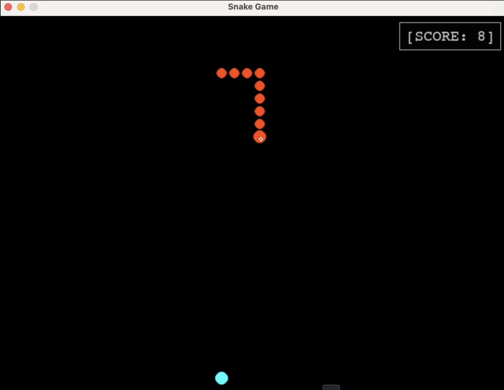
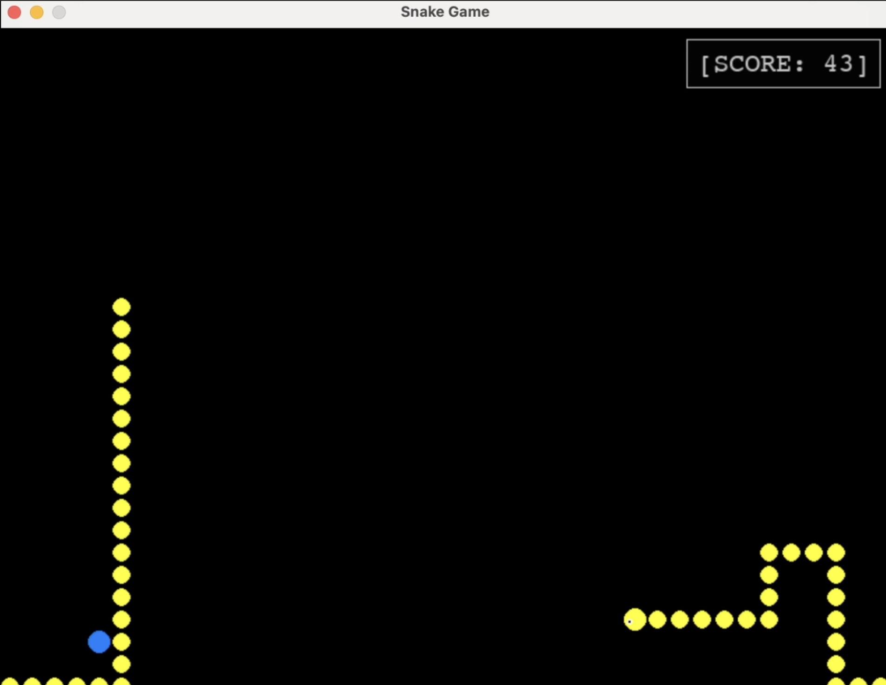

# Snake

(Vibe) coded Snake. 



## Added features:

- The color scheme changes every 5 points
- Particle explosions when eating food
- Semi-transparent score box

## Gameplay

### Controls
- **Arrow Keys**: Control snake direction
- **Enter**: Start the game from the title screen
- **Q**: Quit the game (when game over)
- **C**: Play again (when game over)

## Installation

### Prerequisites
- Python 3.6 or higher
- pip (Python package installer)

### Setup
1. Clone or download this repository
2. Navigate to the project directory
3. Install dependencies:
   ```bash
   pip install -r requirements.txt
   ```
4. Run the game:
   ```bash
   python snake.py
   ```

## Play in a browser

Two web versions live in [`web/`](web/):

- **`web/canvas/`** — a vanilla-JS HTML5 canvas reimplementation. No build
  step; just open `web/canvas/index.html`. This is the version embedded on
  [lawrencetello.com](https://lawrencetello.com).
- **`web/pygame/`** — the real pygame game compiled to WebAssembly with
  [pygbag](https://github.com/pygame-web/pygbag) (`pip install pygbag && cd web/pygame && pygbag .`).

See [`web/README.md`](web/README.md) for details.

# Screenshots





